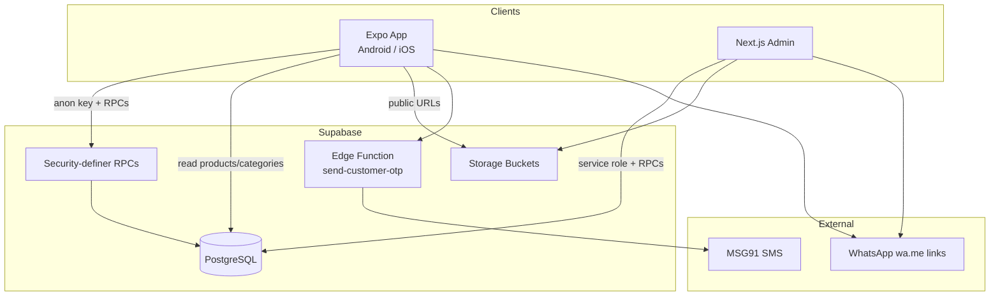

# GT Mart — Design & Technical Document

**Version:** 1.0.0  
**Last updated:** June 2026  
**Products:** Customer mobile app · Admin web panel · Supabase backend

---

## 1. Product overview

GT Mart is a **local grocery delivery** app for a neighbourhood store. Customers browse departments, search products, build a cart, and place **cash-on-delivery (COD)** orders. Shop staff manage catalog and orders through a separate admin panel.

### Goals

| Goal | How it is met |
|------|----------------|
| Fast browsing | Category grid on home, paginated product grids |
| Low friction checkout | Guest checkout supported; profile pre-fill when logged in |
| Shop operations | Admin CRUD for products/categories, order status workflow |
| Local trust | WhatsApp notifications and deep links to the shop number |

### Repositories

| Project | Path | Stack |
|---------|------|-------|
| Customer app | `gt-mart` | Expo 56 · React Native · Expo Router |
| Admin panel | `gt-mart-admin` | Next.js 16 · App Router |
| Backend | Supabase (shared) | PostgreSQL · Storage · Edge Functions · RLS |

**Supabase project:** `https://lesiblcrpxfihahseotg.supabase.co`

---

## 2. System architecture



### Data flow principles

1. **Mobile never uses service role** — only anon key + scoped RPCs.
2. **Sessions are custom** — `customer_sessions` table + RPCs, not Supabase Auth JWT for customers.
3. **Cart is local** — AsyncStorage; synced to server only at order placement.
4. **Prices validated server-side** — `place_order` RPC reads live prices from `products`.

---

## 3. Design system

### 3.1 Brand & visual identity

| Token | Value | Usage |
|-------|-------|--------|
| Primary green | `#1B7A4E` | Headers, CTAs, active tab, links |
| Primary dark | `#145C3A` | Pressed / emphasis |
| Primary light | `#E8F5EE` | Tint backgrounds, badges |
| Accent | `#F4A024` | MRP / highlights |
| Background | `#F7F9F8` | Screen background |
| Surface | `#FFFFFF` | Cards, inputs |
| Foreground | `#1A1F1C` | Body text |
| Muted | `#5C6B63` | Secondary text, placeholders |
| Border | `#E2E8E5` | Card borders, dividers |
| Error | `#D64545` | Validation, remove actions |
| WhatsApp | `#25D366` | WhatsApp CTAs |

Defined in `tailwind.config.js` and `src/constants/theme.ts`.

### 3.2 Typography

- **Headings:** Bold / extrabold, 15–28px depending on screen role
- **Body:** 14–15px for product names and form fields
- **Captions:** 11–13px for blurbs, units, order meta
- **Currency:** `₹` prefix via `CURRENCY` constant

### 3.3 Layout patterns

| Pattern | Description |
|---------|-------------|
| **Shop header** | Full-width green block with title, tagline, search |
| **Hero category cards** | Tinted cards with emoji/image, title, blurb; 3–4 columns responsive |
| **Product grid** | 2-column Blinkit-style cards — square image top, name below, `+` on image |
| **Cart dock** | Collapsible bottom bar on category screens when cart has items |
| **Stack screens** | Category products, order detail — green header with back button |
| **Modals** | Login, signup, checkout — sheet-style over main stack |

### 3.4 Category card design (current)

- **“All products”** — full-width row: primary border, horizontal layout, emoji + label + blurb + arrow
- **Department cards** — per-category `tint` background, `border-2`, rounded-2xl
- **With image** — photo in rounded white frame with light accent border
- **Without image** — large scaled emoji on tint (size ∝ card width)
- **Label + blurb** — title bold inside card; blurb one line muted

Category UI fields live in DB (`emoji`, `tint`, `accent`, `blurb`, `sort_order`, `is_active`, `image_url`).

### 3.5 Product card design

- Fixed half-width column width (no stretch on last row)
- `aspectRatio: 1` image area (native style, not Tailwind `aspect-square`)
- `ProductImage` — photo with emoji fallback on error
- `ProductPrice` — selling price + strikethrough MRP when discounted
- Inline quantity control after first add

### 3.6 Empty & loading states

- `ActivityIndicator` in brand green (`#1B7A4E`)
- `EmptyState` component for empty cart / orders with emoji + CTA text

### 3.7 Accessibility

- `accessibilityRole` on buttons
- `accessibilityLabel` on back navigation
- `numberOfLines` on truncated category/product names

---

## 4. Mobile app — technical specification

### 4.1 Stack

| Layer | Technology |
|-------|------------|
| Framework | Expo SDK 56, React 19, React Native 0.85 |
| Navigation | Expo Router 56 (file-based) |
| Styling | NativeWind 4 + Tailwind CSS 3 |
| Backend client | `@supabase/supabase-js` |
| Persistence | `@react-native-async-storage/async-storage` |
| Gestures | react-native-gesture-handler, reanimated |

### 4.2 Navigation map

```
Root Stack (app/_layout.tsx)
├── (tabs)                    ← Tab bar always available on tab routes
│   ├── index (Shop)          ← Categories + search
│   ├── cart                  ← Full cart + checkout CTA
│   ├── orders                ← Order history
│   └── profile               ← Account settings
├── category/[id]             ← Product list (stack; no tab bar on some configs)
├── order/[id]                ← Order detail + timeline
├── checkout                  ← Modal
├── login / signup / forgot-password
└── edit-profile
```

**Deep link scheme:** `gtmart://`

### 4.3 State management

React Context only — no Redux/Zustand.

| Context | File | Persisted key | Responsibility |
|---------|------|---------------|----------------|
| `CategoriesProvider` | `CategoriesContext.tsx` | — | Fetch active categories, UI meta helpers |
| `AuthProvider` | `AuthContext.tsx` | `@gt_mart_session_id`, `@gt_mart_user` | Session, profile |
| `CartProvider` | `CartContext.tsx` | `@gt_mart_cart` | Cart items, subtotal |
| `OrderProvider` | `OrderContext.tsx` | `@gt_mart_orders` | Orders + Supabase sync |

Provider nesting order: Categories → Auth → Cart → Order.

### 4.4 Key screens

| Screen | File | Behaviour |
|--------|------|-----------|
| Shop home | `app/(tabs)/index.tsx` | Category grid; search triggers paginated product list |
| Category products | `app/category/[id].tsx` | Filter by category or `all`; search; `CartDock` |
| Cart | `app/(tabs)/cart.tsx` | Line items, totals, min-order check |
| Checkout | `app/checkout.tsx` | Address form, COD, `place_order` |
| Orders | `app/(tabs)/orders.tsx` | List from `get_customer_orders` |
| Order detail | `app/order/[id].tsx` | Timeline, WhatsApp actions |
| Profile | `app/(tabs)/profile.tsx` | Login/logout, edit profile |

### 4.5 API layer

| Module | File | Operations |
|--------|------|------------|
| Categories | `categoriesApi.ts` | `select` active categories |
| Products | `productsApi.ts` | Paginated `fetchProductsPage` (20/page) |
| Auth | `authApi.ts` | Register, login, OTP, session RPCs |
| Profile | `profileApi.ts` | `update_customer_profile` |
| Orders | `ordersApi.ts` | `place_order`, `get_customer_orders`, `get_customer_order` |

**Pagination:** `usePaginatedProducts` hook — debounced search, infinite scroll via `onEndReached`.

### 4.6 Core user flows

#### Browse & add to cart

```
Shop home → tap department → Category screen
  → scroll products → tap + on ProductCard
  → CartContext.addItem (AsyncStorage)
```

#### Checkout (from Cart tab or CartDock)

```
Cart → Proceed to Checkout (requires subtotal ≥ ₹500)
  → checkout modal → fill address
  → place_order RPC → clear cart
  → navigate to order/[id]
  → optional WhatsApp to shop
```

#### Authentication (production config)

Password auth enabled (`EXPO_PUBLIC_PASSWORD_AUTH=true`):

```
Signup: register_customer → session stored
Login: login_customer → session stored
Forgot: reset_customer_password
Launch: validate_customer_session restores user
Logout: revoke_customer_session
```

Alternate modes via env: OTP (`send-customer-otp` Edge Function) or phone-only login.

### 4.7 Business rules (config)

From `src/constants/config.ts`:

| Rule | Value |
|------|-------|
| Minimum order | ₹500 |
| Delivery fee | ₹0 |
| Payment | COD only |
| Phone country | India (+91), 10 digits |
| Min password length | 6 |
| Shop WhatsApp | Configured in `SHOP_WHATSAPP_NUMBER` |

### 4.8 Order status lifecycle

```
placed → confirmed → preparing → out_for_delivery → delivered
```

- Customer sees timeline on order detail screen
- Admin advances status in admin panel
- WhatsApp deep links notify customer (logged in `order_notifications`)

---

## 5. Backend — Supabase

### 5.1 Core tables

| Table | Purpose |
|-------|---------|
| `categories` | Department catalog + UI + `image_url` |
| `products` | `item_id`, `item_name`, `mrp`, `price`, `unit`, `category`, `image_url`, `in_stock` |
| `profiles` | Customer name, phone, address |
| `customer_sessions` | Session tokens (password/OTP auth) |
| `customer_login_attempts` | Rate limiting |
| `customer_password_resets` | Reset flow |
| `otp_verifications` | Hashed OTP storage |
| `orders` | Order header, status, delivery, totals |
| `order_items` | Snapshot of line items at order time |
| `order_notifications` | WhatsApp message log |
| `order_number_counters` | `GT-YYYYMMDD-0001` sequencing |
| `admin_users` | Admin credentials (admin app only) |

### 5.2 Storage buckets

| Bucket | Public read | Write | Used for |
|--------|-------------|-------|----------|
| `product-images` | Yes | Admin (service role) | Product photos |
| `category-images` | Yes | Admin (service role) | Category icons |

### 5.3 Security model

- **RLS** on all customer tables — direct anon writes blocked where possible
- **RPCs** with `SECURITY DEFINER` for auth, orders, profile updates
- **Server-side price validation** in `place_order` — client subtotal not trusted
- **OTP stored as hash only** — plaintext never persisted
- **Session scoped** — order list/detail RPCs require valid `session_id`

### 5.4 Migrations (001–022)

Run in order on production Supabase:

| # | File | Summary |
|---|------|---------|
| 001 | `001_initial_schema.sql` | Core schema, `place_order`, RLS MVP |
| 002 | `002_admin_users.sql` | Admin users table |
| 003 | `003_admin_login_rpc.sql` | `verify_admin_login` |
| 004 | `004_admin_login_ready.sql` | Setup check RPC |
| 005 | `005_customer_otp_auth.sql` | OTP + sessions |
| 006 | `006_product_mrp.sql` | MRP column |
| 007 | `007_rename_product_item_columns.sql` | `item_id`, `item_name` |
| 008 | `008_security_hardening.sql` | RLS hardening, session-scoped RPCs |
| 009 | `009_otp_sms_integration.sql` | Edge Function OTP hash storage |
| 010 | `010_phone_only_auth.sql` | Phone-only login RPC |
| 011 | `011_customer_password_auth.sql` | Password auth + bcrypt |
| 012 | `012_fix_register_duplicate_phone.sql` | Duplicate phone fix |
| 013 | `013_customer_reset_password.sql` | Password reset RPC |
| 014 | `014_ensure_customer_order_rpcs.sql` | Idempotent order RPCs |
| 015 | `015_fix_revoke_session.sql` | Logout fix |
| 016 | `016_live_categories.sql` | Live store categories seed |
| 017 | `017_product_images.sql` | Product images bucket |
| 018 | `018_general_items_category.sql` | General items category |
| 019 | `019_chocolates_ice_creams_categories.sql` | More categories |
| 020 | `020_delete_seed_products.sql` | Remove demo products |
| 021 | `021_category_ui_fields.sql` | Category UI columns |
| 022 | `022_category_images.sql` | Category images bucket |

### 5.5 Edge Functions

| Function | Path | Purpose |
|----------|------|---------|
| `send-customer-otp` | `supabase/functions/send-customer-otp/` | SMS via MSG91/Twilio/log |

**Secrets:** `SMS_PROVIDER`, `MSG91_AUTH_KEY`, `MSG91_TEMPLATE_ID`, `TWILIO_*`

---

## 6. Admin panel — technical specification

**Path:** `gt-mart-admin`

### 6.1 Stack

Next.js 16 (App Router), React 19, Tailwind CSS 4, Supabase JS, xlsx for Excel import.

### 6.2 Routes

| Route | Purpose |
|-------|---------|
| `/login` | Admin authentication |
| `/orders` | Order list, status updates, filters |
| `/products` | Product list (paginated) |
| `/products/new`, `/products/[id]/edit` | Product CRUD + image upload |
| `/categories` | Category list |
| `/categories/new`, `/categories/[id]/edit` | Category CRUD + image upload |

### 6.3 Auth

- Cookie: `gt_mart_admin_session`
- Middleware protects all routes except `/login` and `/api/auth/*`
- Login via `verify_admin_login` RPC
- Server actions use **service role** for writes and storage uploads

### 6.4 Features

- Product Excel import
- Image upload to `product-images` / `category-images`
- Order status advancement (same enum as mobile)
- Category management drives mobile home grid (no hardcoded categories in app)

### 6.5 Admin environment variables

```
NEXT_PUBLIC_SUPABASE_URL
NEXT_PUBLIC_SUPABASE_ANON_KEY
SUPABASE_SERVICE_ROLE_KEY    # required for uploads/writes
ADMIN_PASSWORD               # optional, for create-admin script
```

---

## 7. Build & deployment

### 7.1 Mobile (EAS)

**Config:** `eas.json`, `app.json`

| Profile | Output | Distribution | Use |
|---------|--------|--------------|-----|
| `development` | APK | Internal | Dev client |
| `preview` | APK | Internal | Customer testing |
| `production` | AAB | Play Store | Production release |

```bash
cd gt-mart
eas build --platform android --profile preview      # test APK
eas build --platform android --profile production # Play Store AAB
```

**EAS owner:** `gtmart-kvl`  
**Bundle ID:** `com.gtmart.app`  
**Typical APK size:** ~90–100 MB (normal for Expo/RN)

### 7.2 Mobile environment variables (baked at build)

Set in `eas.json` for preview/production:

```
EXPO_PUBLIC_SUPABASE_URL
EXPO_PUBLIC_SUPABASE_ANON_KEY
EXPO_PUBLIC_OTP_DEV_MODE=false
EXPO_PUBLIC_PHONE_ONLY_AUTH=false
EXPO_PUBLIC_PASSWORD_AUTH=true
```

Local dev: copy `.env.example` → `.env`, restart with `npx expo start --clear`.

### 7.3 Admin deployment

Standard Next.js deploy (Vercel, Node host, etc.) with env vars above plus service role key.

### 7.4 Database

Apply migrations via Supabase SQL editor or CLI in numerical order. Do not re-run `seed.sql` if migrations 016–022 already applied.

---

## 8. Component reference (mobile)

| Component | Path | Role |
|-----------|------|------|
| `CategoryHeroCards` | `src/components/CategoryHeroCards.tsx` | Home department grid |
| `CategoryImage` | `src/components/CategoryImage.tsx` | Category emoji/photo sizes |
| `ProductCard` | `src/components/ProductCard.tsx` | Grid product tile |
| `ProductGridList` | `src/components/ProductGridList.tsx` | 2-col paginated list |
| `ProductImage` | `src/components/ProductImage.tsx` | Product photo + fallback |
| `CartItemRow` | `src/components/CartItemRow.tsx` | Cart line item |
| `CartDock` | `src/components/CartDock.tsx` | Category screen cart bar |
| `OrderStatusTimeline` | `src/components/OrderStatusTimeline.tsx` | Order progress |
| `Button` | `src/components/Button.tsx` | Primary/outline CTAs |
| `EmptyState` | `src/components/EmptyState.tsx` | Empty views |

---

## 9. Type definitions

Core types in `src/types/index.ts`:

- `ShopCategory` — id, label, emoji, imageUrl, tint, accent, blurb, sortOrder
- `Product` — id, name, mrp, price, unit, category, emoji, imageUrl, inStock
- `CartItem` — product + quantity
- `Order` / `OrderItem` / `OrderStatus`
- `UserProfile` / `DeliveryAddress`
- `PaymentMethod` — `'cod'` only

---

## 10. Local development

```bash
# Mobile
cd gt-mart
cp .env.example .env    # add Supabase keys
npm install
npx expo start

# Admin
cd gt-mart-admin
cp .env.example .env    # add Supabase keys + service role
npm install
npm run dev
```

Without Supabase env vars, mobile falls back to mock data and local AsyncStorage auth.

---

## 11. Future considerations

| Area | Suggestion |
|------|------------|
| Payments | UPI / Razorpay alongside COD |
| Push notifications | Expo Notifications for order status |
| iOS release | EAS `production` profile for App Store |
| Cart dock | Extend to shop search results screen |
| Image optimization | `expo-image` + CDN transforms for smaller loads |
| Analytics | Expo / Firebase for funnel tracking |
| Multi-store | Store id on products/orders if expanding beyond one shop |

---

## 12. Document history

| Date | Change |
|------|--------|
| Jun 2026 | Initial design & technical document v1.0 |
